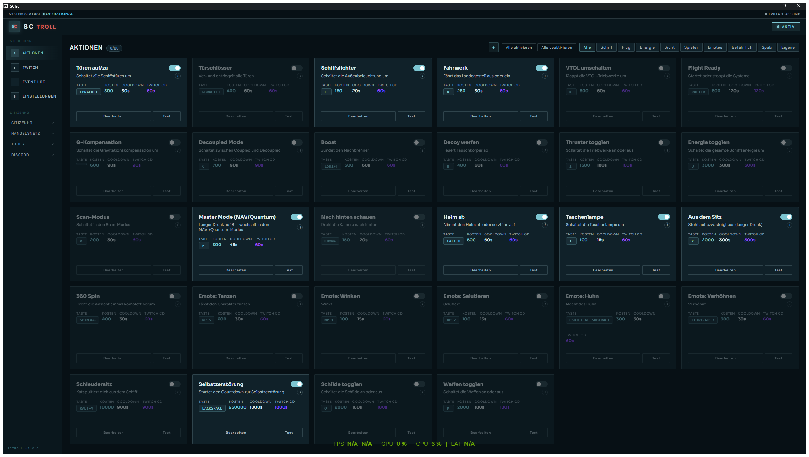
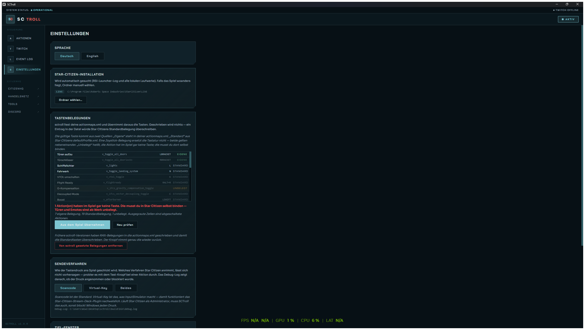
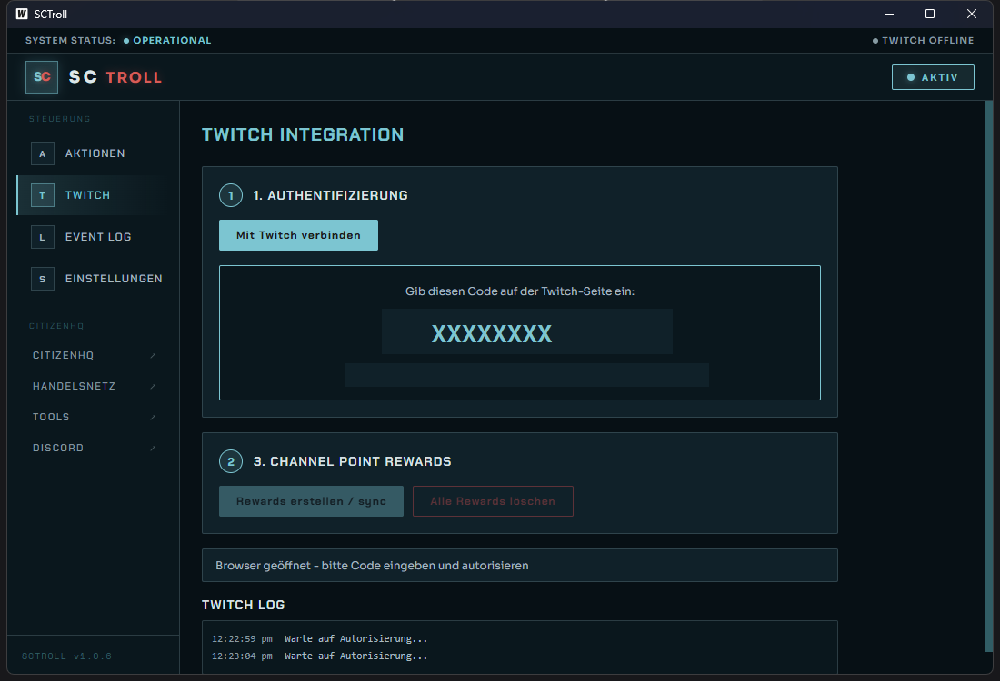

# SCTroll

**Twitch-Kanalpunkte für Star Citizen.** Zuschauer lösen per Einlösung Aktionen im Spiel aus —
Türen öffnen, Licht ausschalten, Fahrwerk ausfahren, in den NAV-Modus wechseln, Emotes,
Schleudersitz.

Windows-Desktop-App in Go ([Wails](https://wails.io) + Svelte). Kein Overlay, kein Browser,
keine Änderung am Spiel.

[](https://github.com/miwidot/sctroll/releases/latest)
[](LICENSE)



---

## Herunterladen

**[Neueste Version herunterladen](https://github.com/miwidot/sctroll/releases/latest)** —
eine einzelne signierte `.exe`, keine Installation nötig.

Die Programmdatei ist mit einem Certum-Zertifikat signiert und zeitgestempelt, Windows meldet
also keinen unbekannten Herausgeber. Prüfen lässt sich das jederzeit selbst:

```powershell
Get-AuthenticodeSignature .\SCTroll-*-windows-amd64.exe | Format-List Status, SignerCertificate
Get-FileHash .\SCTroll-*-windows-amd64.exe -Algorithm SHA256
```

Zu jeder Version liegt die SHA256-Prüfsumme als eigene Datei bei. Neue Versionen meldet
SCTroll ab 1.0.7 selbst, siehe [Updates](#updates).

**Voraussetzungen:** Windows 10/11 · Star Citizen einmal gestartet · Twitch Affiliate oder
Partner (nur dann gibt es Kanalpunkte)

---

## Inhalt

- [Wie es funktioniert](#wie-es-funktioniert)
- [Der schwierige Teil: die Tastenbelegungen](#der-schwierige-teil-die-tastenbelegungen)
- [Einrichtung](#einrichtung)
- [Aktionen](#aktionen)
- [Mit Windows starten](#mit-windows-starten)
- [Updates](#updates)
- [Sicherheitsnetze](#sicherheitsnetze)
- [Wenn nichts passiert](#wenn-nichts-passiert)
- [Twitch-Anbindung](#twitch-anbindung)
- [Star-Citizen-Installation finden](#star-citizen-installation-finden)
- [Bauen und signieren](#bauen-und-signieren)
- [Projektaufbau](#projektaufbau)
- [Dank](#dank)

---

## Wie es funktioniert

```
Zuschauer löst Kanalpunkt-Reward ein
        │
        ▼
Twitch EventSub (WebSocket)  ──►  SCTroll
        │
        ├─ Ist Star Citizen im Vordergrund?      nein ─► Punkte zurück
        ├─ Läuft ein Cooldown?                   ja   ─► Punkte zurück
        ├─ Ist die Aktion aktiv?                 nein ─► Punkte zurück
        │
        ▼
Warteschlange (eine Aktion nach der anderen)
        │
        ▼
SendInput  ──►  Star Citizen
        │
        ▼
Einlösung als erledigt markiert
```

SCTroll meldet sich per **EventSub over WebSocket** bei Twitch an und bekommt jede Einlösung
gemeldet. Passt sie zu einer konfigurierten Aktion, wird die zugehörige Taste per
`SendInput` gedrückt — mit der Haltezeit, die Star Citizen für diese Aktion braucht.

Alle Tastendrücke laufen durch **eine** Warteschlange. Ohne das würden sich zwei gleichzeitige
Einlösungen überlappen und bei langen Haltezeiten eine Taste hängen lassen.

---

## Der schwierige Teil: die Tastenbelegungen

Das ist der Punkt, an dem solche Tools üblicherweise scheitern. Star Citizen verwaltet
Tastenbelegungen in zwei Dateien, und beide muss man verstehen:

### `actionmaps.xml` — deine Abweichungen

```
<Installation>\user\client\0\Profiles\default\actionmaps.xml
```

Diese Datei enthält **ausschließlich, was du gegenüber dem Standard geändert hast**. Alles
andere steht dort gar nicht drin.

Daraus folgt etwas Wichtiges: ein Eintrag in dieser Datei ist kein Zusatz, sondern eine
**Überschreibung**. Wer eine Aktion dort einträgt, nimmt sich die Standardtaste weg.
**SCTroll schreibt deshalb grundsätzlich nichts in diese Datei.** Es liest nur.

### `defaultProfile.xml` — Star Citizens Standardbelegung

Steckt im Spiel in der `Data.p4k` und ist dort nicht ohne weiteres lesbar. SCTroll bringt
eine entpackte Kopie mit: **1097 Aktionen in 50 Actionmaps**, inklusive der Aktivierungsart
jeder Aktion.

### Und der Punkt, den fast alle falsch machen

**Eine Joystick-Belegung ersetzt die Tastaturbelegung nicht.** Wer eine Aktion auf
`js1_button4` legt, kann sie weiterhin über die Standardtaste auslösen — und genau die
drückt SCTroll. Ein HOTAS-Setup bedeutet also *nicht*, dass man alles neu binden müsste.

### Die Auflösung in drei Stufen

| Quelle | Bedeutung |
|---|---|
| **Eigene** | Die Aktion steht in deiner `actionmaps.xml` — diese Taste gilt. |
| **Standard** | Sie steht nicht drin und läuft auf Star Citizens Standardtaste. |
| **Unbelegt** | Die Aktion hat ab Werk gar keine Taste. Türen und Emotes zum Beispiel. |



Bei *unbelegt* drückt SCTroll bewusst nichts, statt auf gut Glück eine Taste zu senden.
Wer diese Aktionen im Spiel gebunden hat, bekommt sie über **Aus dem Spiel übernehmen** —
und fehlende Tasten werden auch beim Programmstart automatisch nachgezogen.

### Haltezeiten kommen aus dem Spiel

`defaultProfile.xml` sagt pro Aktion, wie sie ausgelöst wird. Daraus leitet SCTroll ab, wie
lange die Taste gedrückt bleiben muss:

| `activationMode` | Haltezeit | Beispiel |
|---|---|---|
| `press`, `tap` | 80 ms | Licht, Fahrwerk |
| `delayed_press` | 500 ms | Master Mode (langer Druck auf `B`) |
| `hold`, `onHold="1"` | 800 ms | Decoy, aus dem Sitz aufstehen |
| `delayed_press_medium` | 900 ms | |
| `delayed_hold_long` | 1600 ms | |

Das ist kein Detail: mit 80 ms passiert bei einer Halteaktion auch mit korrekter Taste
nichts. Star Citizen schluckt zu kurze Drücke.

### F13–F24 gehen nicht

Star Citizen kann diese Tasten nicht binden — CryEngine kennt die Keycodes nicht
([Spectrum-Thread](https://robertsspaceindustries.com/spectrum/community/SC/forum/3/thread/add-f13-f24-keys-support/)).
Der sonst übliche Trick, Zuschauer-Aktionen auf Tasten zu legen, die keine echte Tastatur
sendet, fällt hier also weg.

---

## Einrichtung

1. **Star Citizen einmal starten und beenden.** Erst dann existiert die `actionmaps.xml`.
2. SCTroll starten. Die Installation wird automatisch gefunden — sonst unter
   *Einstellungen* den Ordner wählen.
3. Unter **Aktionen** auswählen, was die Zuschauer dürfen.
4. Bei Aktionen, die als *unbelegt* geführt werden: im Spiel binden, dann
   *Einstellungen → Aus dem Spiel übernehmen*.
5. **Twitch verbinden.** Der Browser öffnet sich mit einem Code, den du auf der Twitch-Seite
   bestätigst. Die Rewards werden danach automatisch auf deinem Kanal angelegt — von Hand
   ist nichts einzurichten.
6. Bei einer Aktion auf **Test** drücken, ins Spiel wechseln — kommt die Taste an?

Die Anmeldung hält über Neustarts: der Zugangstoken wird im Hintergrund erneuert, bevor er
abläuft. Nur wenn du den Zugriff auf Twitch-Seite widerrufst, ist eine neue Anmeldung fällig.



---

## Aktionen

30 mitgelieferte Aktionen. Die Tasten sind Star Citizens echte Standardbelegungen.

Die **Beschreibung** einer Aktion ist zugleich der Text, den deine Zuschauer beim Einlösen
sehen — Twitch zeigt sie unter der Belohnung an.

| Kategorie | Aktion | Taste | Halten |
|---|---|---|---|
| Schiff | Türen auf/zu | *unbelegt* | 80 ms |
| Schiff | Türschlösser | *unbelegt* | 80 ms |
| Schiff | Schiffslichter | `L` | 80 ms |
| Schiff | Fahrwerk | `N` | 80 ms |
| Schiff | VTOL umschalten | `K` | 80 ms |
| Schiff | Flight Ready | `RAlt+R` | 80 ms |
| Flug | Master Mode (NAV/Quantum) | `B` | **500 ms** |
| Flug | Decoupled Mode | `C` | 80 ms |
| Flug | Boost | `LShift` | 1500 ms |
| Flug | Decoy werfen | `H` | **800 ms**, 3× |
| Flug | G-Kompensation | *unbelegt* | 80 ms |
| Energie | Energie togglen | `U` | 80 ms |
| Energie | Thruster togglen | `I` | 80 ms |
| Energie | Schilde togglen | `O` | 80 ms |
| Energie | Waffen togglen | `P` | 80 ms |
| Sicht | Scan-Modus | `V` | 80 ms |
| Sicht | Nach hinten schauen | `Comma` | 2000 ms |
| Spieler | Helm ab | `LAlt+H` | 80 ms |
| Spieler | Taschenlampe | `T` | 80 ms |
| Spieler | Aus dem Sitz | `Y` | **900 ms** |
| Spieler | Nachladen | `R` | 80 ms |
| Spieler | Granate werfen | `G` + linke Maustaste | zweistufig |
| Spaß | 360 Spin | *Mausbewegung* | — |
| Emotes | Tanzen, Winken, Salutieren, Huhn, Verhöhnen | *unbelegt* | 80 ms |
| Gefährlich | Schleudersitz | `RAlt+Y` | 200 ms |
| Gefährlich | Selbstzerstörung | `Backspace` | **15 s** |

Pro Aktion lassen sich außerdem **Obergrenzen pro Stream** und **pro Zuschauer und Stream**
setzen (0 = unbegrenzt). Durchgesetzt werden sie von Twitch: die Belohnung wird ausgeblendet,
sobald die Grenze erreicht ist — bevor Punkte abgebucht werden.

Eigene Aktionen lassen sich über das **+** anlegen: beliebige Taste, Tastenkombination,
Maustaste, Wiederholungen oder eine mehrstufige Abfolge. Maustasten zählen wie im Spiel:
`mouse1` ist links, `mouse2` rechts, `mouse3` die mittlere. Eindeutiger sind `lmouse`,
`rmouse` und `mmouse`.

---

## Mit Windows starten

Ein Schalter in den Einstellungen trägt SCTroll in den Autostart ein — unter
`HKEY_CURRENT_USER`, also ohne Administratorrechte. Bewusst über die Registry statt einer
Verknüpfung im Autostart-Ordner: der Eintrag enthält den Pfad direkt, es entsteht keine zweite
Datei, die nach einem Verschieben ins Leere zeigt.

Nach einem Update oder einem verschobenen Ordner wird der Eintrag beim Start automatisch
nachgezogen.

## Updates

SCTroll prüft beim Start still im Hintergrund auf neue Versionen und zeigt sie als Leiste über
der Oberfläche. **Eingespielt wird nur auf Knopfdruck** — ein Neustart mitten im Stream wäre
ein schlechter Zeitpunkt, den das Programm nicht selbst wählen sollte. In den Einstellungen
lässt sich auch von Hand suchen.

Vor dem Austausch wird zweifach geprüft: die **SHA256-Prüfsumme** gegen die veröffentlichte
Datei und die **Authenticode-Signatur** über `WinVerifyTrust` — dieselbe Prüfung, die Windows
beim Ausführen macht. Die Prüfsumme allein würde nur einen heilen Download belegen; erst die
Signatur belegt die Herkunft.

Liegt SCTroll in einem geschützten Ordner wie `C:\Program Files`, schlägt der Austausch mangels
Schreibrechten fehl. Dann wird zurückgerollt, die alte Version läuft weiter, und die neue lässt
sich von Hand von der Releases-Seite holen.

## Sicherheitsnetze

- **Not-Aus** im Header pausiert alles und deaktiviert die Rewards auf Twitch.
- **Erstattung**: Ist das Spiel nicht im Vordergrund, läuft ein Cooldown oder ist die Aktion
  aus, bekommt der Zuschauer seine Kanalpunkte automatisch zurück.
- **Gefährliche Aktionen** sind standardmäßig **aus**, kosten 10.000 bzw. 25.000 Punkte und
  haben 15 bzw. 30 Minuten Cooldown.
- **Zwei Cooldowns**: einer lokal, einer auf Twitch-Seite (Minimum 60 s).
- **Tastensperre**: Blockiert per Low-Level-Hook optional Tasten, während eine Aktion läuft,
  damit eine physisch gehaltene Taste sie nicht überschreibt.
- **Warteschlange**: Aktionen laufen seriell, nichts überlappt.

---

## Wenn nichts passiert

Star Citizen liest Tastatur über Raw Input, nicht über die Windows-Message-Queue. Der
`SendInput`-Aufruf muss deshalb genau passen. Unter *Einstellungen → Sendeverfahren*
lassen sich drei Varianten durchprobieren:

| Verfahren | Was gesendet wird |
|---|---|
| **Scancode** (Standard) | Reiner Scancode, `Vk = 0`, Extended-Bit über `MAPVK_VK_TO_VSC_EX` |
| **Virtual-Key** | Virtueller Keycode — das macht `InputSimulator`, womit das Star-Citizen-Stream-Deck-Plugin nachweislich funktioniert |
| **Beides** | Erst Scancode, dann Virtual-Key |

Der **Test**-Knopf bei jeder Aktion löst sie nach 5 Sekunden Vorlauf aus — genug Zeit, um ins
Spiel zu wechseln. Danach steht im Debug-Log (`build/bin/debug.log`) pro Tastendruck:

```
sendKey[scancode]: vk=0x4C scan=0x26 ext=false down ok
sendKey[scancode]: BLOCKIERT vk=0x4C scan=0x26 ext=false down ret=0 err=...
```

- **`BLOCKIERT`** → Windows blockt (UIPI). Läuft Star Citizen als Administrator, muss SCTroll
  das auch.
- **`ok`, aber im Spiel passiert nichts** → anderes Sendeverfahren probieren.
- Hilft beides nicht, greift vermutlich das Anti-Cheat. Dann führt nur ein Hardware-Weg zum
  Ziel — ein USB-HID-Gerät, wie es [ControlPlay](https://controlplay.app) benutzt.

---

## Twitch-Anbindung

**Device Code Flow** — die Anmeldung läuft über einen Code im Browser, ohne Client Secret in
der App.

Benötigte Scopes: `channel:read:redemptions`, `channel:manage:redemptions`.

### Warum die App vom Typ „Public" ist

Twitch unterscheidet zwei App-Typen, und das entscheidet über den Token-Refresh:

| Client Type | Anmeldung | Erneuern |
|---|---|---|
| **Public** | ohne Secret | ✅ ohne Secret |
| **Confidential** | ohne Secret | ❌ **verlangt das Secret** |

Eine Confidential-App lässt sich anmelden, aber nach ein paar Stunden nicht mehr erneuern —
im Debug-Log steht dann `missing client secret`, und die Anmeldung ist bei jedem Start fällig.
Die mitgelieferte App ist deshalb als **Public** registriert. Für solche Apps existiert gar
kein Secret, es kann also auch keins mitgeliefert werden oder abhanden kommen.

Wer eine **eigene App** benutzen will: auf
[dev.twitch.tv/console/apps](https://dev.twitch.tv/console/apps) anlegen, *Client Type* auf
**Public**, OAuth Redirect URL `http://localhost` (Pflichtfeld, wird beim Device Code Flow
nicht benutzt). Client-ID im Twitch-Tab unter *Twitch-App* eintragen.

Für eine bestehende **Confidential-App** lässt sich dort auch das Client Secret hinterlegen.
Es wird nur mitgeschickt, wenn gesetzt, und liegt ausschließlich lokal.

> Tokens und Rewards gehören immer zu genau einer Client-ID. Ein Wechsel bedeutet: einmal neu
> anmelden, und die alten Rewards vorher löschen — für die neue App sind sie nicht mehr
> verwaltbar und blieben sonst doppelt auf dem Kanal stehen.

Die Anmeldung überlebt Neustarts:

- Der Access Token wird **15 Minuten vor Ablauf** im Hintergrund erneuert. Ohne das fällt ein
  Ablauf erst auf, wenn mitten im Stream nichts mehr auslöst — die EventSub-Verbindung meldet
  keinen Fehler, sie wird still widerrufen.
- Ein fehlgeschlagener Refresh **löscht die Anmeldung nicht**. Nur HTTP 400/401 gilt als
  endgültige Ablehnung; 500er, Rate Limits und Netzausfälle sind vorübergehend.
- Beim Start wird mit steigenden Abständen erneut versucht (0/3/10/30/60 s), weil beim
  Hochfahren oft noch kein Netz da ist.
- `session_reconnect` von Twitch wird sauber übernommen, ohne Subscriptions zu doppeln.

Rewards, die SCTroll anlegt, haben `should_redemptions_skip_request_queue: false` — sonst
gilt eine Einlösung sofort als erledigt und ließe sich nicht mehr erstatten.

Eine eigene Client-ID lässt sich in `%APPDATA%\SCTroll\config.json` unter `twitch.client_id`
setzen.

> Die Tokens liegen im Klartext in `%APPDATA%\SCTroll\config.json`. Nicht weitergeben und
> nicht auf Screenshots zeigen — der Token darf Kanalpunkt-Rewards verwalten.

---

## Star-Citizen-Installation finden

Das Spiel liegt nicht zwingend auf `C:`. Gesucht wird in dieser Reihenfolge:

1. **RSI-Launcher-Log** (`%APPDATA%\rsilauncher\logs\log.log`) — enthält den Installationspfad
   im Klartext und kennt auch eine Library, die irgendwo auf `E:\Spiele\` liegt. Die Registry
   hilft nicht, dort steht nur `EACServiceInstalled`, und `launcher store.json` ist
   verschlüsselt.
2. **Bekannte Ordner auf allen lokalen Festplatten.** Netzlaufwerke und Wechselmedien werden
   übersprungen, sonst blockiert der Scan.
3. **Flacher Scan** der obersten zwei Ebenen jedes Laufwerks.
4. **Manuelle Auswahl** über den Ordnerdialog.

Alle Channels werden erkannt (LIVE, PTU, EPTU, HOTFIX, TECH-PREVIEW), LIVE wird bevorzugt.

---

## Bauen und signieren

Voraussetzungen: Go 1.23+, Node 18+, [Wails CLI](https://wails.io/docs/gettingstarted/installation) v2.

```powershell
wails build                  # -> build/bin/SCTroll.exe
go test ./internal/...
```

Signierter Build (Certum SimplySign Desktop muss laufen und per App angemeldet sein):

```powershell
.\build-signed.ps1
```

Die Tests laufen teilweise gegen eine **Kopie** einer echt installierten `actionmaps.xml` und
überspringen sich, wenn kein Star Citizen gefunden wird. Dein Spielprofil wird dabei nie
verändert. Abgedeckt sind unter anderem:

- XML-Round-Trip ohne Verlust von Joystick- und Geräteeinstellungen
- jede mitgelieferte Aktion existiert in der `defaultProfile.xml`
- Haltezeiten passen zum `activationMode`
- Token-Refresh fasst bei Serverfehlern die Zugangsdaten nicht an
- gefährliche Aktionen sind standardmäßig aus

---

## Projektaufbau

| Pfad | |
|---|---|
| `internal/starcitizen/install.go` | Installationssuche über alle Laufwerke |
| `internal/starcitizen/actionmaps.go` | `actionmaps.xml` lesen (eigene Belegungen) |
| `internal/starcitizen/defaultprofile.go` | eingebettete `defaultProfile.xml`, Haltezeiten |
| `internal/starcitizen/process.go` | läuft das Spiel gerade? |
| `internal/twitch/twitch.go` | Device Code Flow, Token-Verwaltung, EventSub, Rewards, Erstattungen |
| `internal/actions/executor.go` | Cooldowns, Warteschlange, Fenster-Prüfung, Ausführung |
| `internal/input/input.go` | `SendInput`, Sendeverfahren, Tastennamen |
| `internal/updater/` | Update-Prüfung, Download, Signaturprüfung, Austausch |
| `internal/version/` | Programmversion und Versionsvergleich |
| `internal/autostart/` | Autostart-Eintrag in der Registry |
| `build/make-icon.ps1` | erzeugt Programmsymbol und `icon.ico` aus Code |
| `internal/keylock/keylock.go` | Low-Level-Keyboard-Hook |
| `app.go` | Wails-Bindings fürs Frontend |
| `frontend/` | Svelte-Oberfläche, Deutsch und Englisch |

Die Konfiguration liegt unter `%APPDATA%\SCTroll\config.json`. Eine neuere selbst entpackte
`defaultProfile.xml` kann daneben abgelegt werden und hat dann Vorrang — praktisch nach einem
größeren Patch.

---

## Dank

- **[ltmajor42/StarCitizen_Streamdeck_Plugin](https://github.com/ltmajor42/StarCitizen_Streamdeck_Plugin)**
  und **[mhwlng/streamdeck-starcitizen](https://github.com/mhwlng/streamdeck-starcitizen)** —
  von dort stammt die entpackte `defaultProfile.xml`, und von dort kam der entscheidende
  Hinweis, wie Standard- und eigene Belegungen zusammenspielen.
- **[citizenhq.space](https://citizenhq.space)** — Farbpalette und Formensprache der Oberfläche.
- **[Wails](https://wails.io)** — Go-Desktop-Framework.

Schriften: Chakra Petch, Sora und Space Mono (SIL Open Font License), lokal eingebettet.

Die mitgelieferte `defaultProfile.xml` ist Spieldatei von Cloud Imperium Games und liegt hier
nur, damit SCTroll die Standardbelegungen kennt.

Kein offizielles Produkt von Cloud Imperium Games. Star Citizen® ist eine Marke von CIG.

---

## Lizenz

MIT — siehe [LICENSE](LICENSE).
